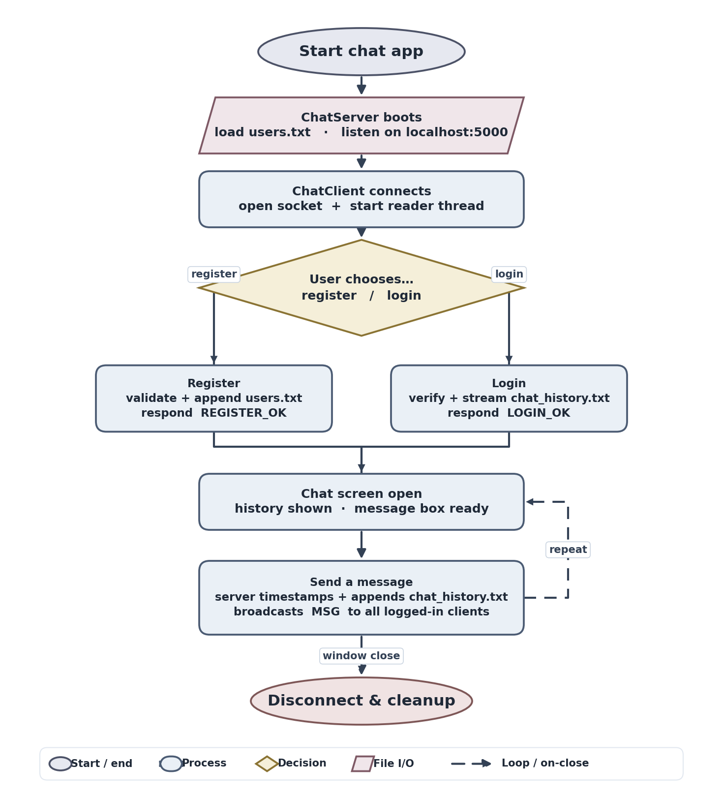

# Java Finals Chat System

A simple Java socket chat application with account registration, login, message broadcasting, and saved chat history. The project uses only the Java standard library and keeps the server and client in separate single-file programs.

## Features

- Multi-client chat server using `ServerSocket`
- One thread per connected client
- Login and registration commands
- Duplicate-login prevention
- Thread-safe client and user tracking
- Broadcast messages to all logged-in users
- Message timestamps and usernames
- Chat history loaded after login
- Swing GUI client with separate auth and chat screens
- Local file persistence for users and messages

## Requirements

- Java Development Kit, JDK 8 or newer
- A terminal or command prompt

No external libraries are required.

## Project Files

| File | Purpose |
| --- | --- |
| `ChatServer.java` | Starts the local chat server, handles clients, accounts, broadcasts, and persistence |
| `ChatClient.java` | Starts the Swing GUI client and connects to the local server |
| `users.txt` | Stores registered usernames and passwords locally |
| `chat_history.txt` | Stores saved chat messages |
| `instructions.md` | Original project requirements |

## High-Level System Flowchart



The v2 diagram shows the essential happy path: boot, connect, auth choice, branch into register / login, merge into chat, send-and-broadcast loop, disconnect. It is generated by [`flowchart/v2/generate_flowchart.py`](flowchart/v2/generate_flowchart.py) using matplotlib, and is exported to PNG, SVG, and PDF:

```bash
python flowchart/v2/generate_flowchart.py
```

## Compile

From the project folder:

```bash
javac ChatServer.java ChatClient.java
```

## Run

Start the server first:

```bash
java ChatServer
```

Then open one or more clients in separate terminals:

```bash
java ChatClient
```

The client connects to:

```text
localhost:5000
```

## How To Demo

1. Compile both Java files.
2. Run `java ChatServer`.
3. Run `java ChatClient` twice to simulate two users.
4. Register a different account in each client.
5. Log in with both accounts.
6. Send a message from one client.
7. Confirm the message appears in both clients.
8. Close and reopen a client, log in again, and confirm previous messages load.

## Client Commands

The GUI sends these commands to the server:

```text
/register username password
/login username password
```

After login, normal text typed into the message box is sent as a chat message.

## Data Format

Registered users are saved in `users.txt`:

```text
username password
```

Chat messages are saved in `chat_history.txt`:

```text
[HH:mm:ss] username: message
```

## Notes

- Usernames may contain letters, numbers, and underscores.
- Usernames are limited to 20 characters.
- The server binds to `localhost`, so it is intended for local demos.
- Passwords are stored as plain text because this is a minimal academic socket project.
